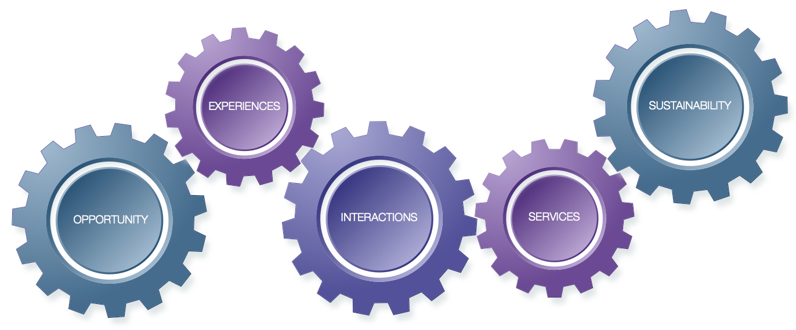

# Synthesise


**Syntesise** actionable insights from the data gathered. Identify reoccurring problems, expose unexpressed needs and uncover sought after convenience. Capture and prioritise these in a platform model.


The design of products and services is an activity of experts who work as problem solvers and prescribe the value process of value creation. In contrast, platforms shift the control of value creation towards the [participants](../../appendix/glossary.md#p). It's them that are solving problems in self-organised and self-optimised interactions. Platform designers cannot predict nor prescribe such interactions. They can only set the interfaces, processes and conditions for interactions to happen. 

Well-designed interfaces and processes tend to lead to particular types of outcomes. A _platform model_ balances platform intent and platform structure. It captures how the platform enables and empowers participants to act towards intended outcomes. At its core, the model lays out the platform's mechanisms of value creation, distribution and compensation.

A platform model is more layered and convoluted than a [conventional business model](https://strategyzer.com/canvas/business-model-canvas). To add as little cognitive load as possible, FAST modularises model construction. Each module synthesis a single well-defined concern of a platform’s design:

* \*\*\*\*[**OPPORTUNITY**](opportunity.md) ****— What are the opportunities for [ecosystem mobilisation](../../appendix/glossary.md#e) given the observed trends and forces? What are [entities](../../appendix/glossary.md#e)' assets and capabilities for participation in these dynamics?
* \*\*\*\*[**EXPERIENCES**](experiences.md) — What are the [roles](../../appendix/glossary.md#p) played in the opportunity for mobilisation? What experience gains help them meet performance pressures, achieve life goals or generate convenience?
* \*\*\*\*[**INTERACTIONS**](interactions.md) — What are the interactions underpinning these experiences? What are the resources leveraged, what is the value exchanged, and what are the contexts and channels of exchange?
* \*\*\*\*[**SERVICES**](services.md) — What are the tools, processes, data and systems that enable the interactions at the envisioned scale, scope and speed? What are the interfaces, rules and policies that govern their use?
* \*\*\*\*[**SUSTAINABILITY**](sustainability.md) — What operating model does the platform need to enable and empower the participants—now and over time? What kind of pull compels the participants to join and interact?

