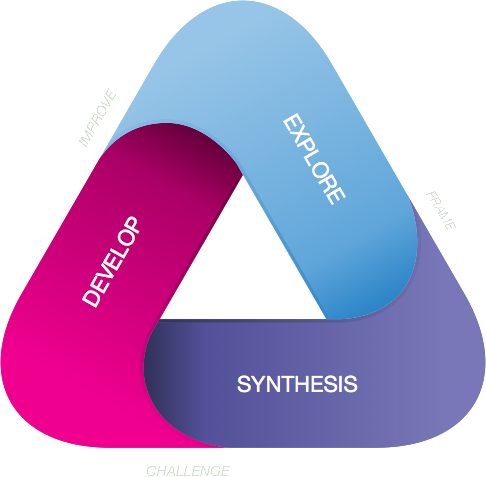

# FAST Triangle

The design of products and services is an activity of experts who work as problem solvers and prescribe the value process of value creation. There is no such breadth of control in platform design. It's the platform participants that solve the problems in self-organised and self-optimised interactions. The platform designer sets the interfaces, processes and conditions for these interactions to happen, not able to predict the exact outcomes.

FAST promotes prototyping to explore and test interactions, and highlight opportunities and challenges. It is part of a continuous design process of building relations with the diverse participants. The design itself is an open-ended structure, acting as a device for prototyping. It guides in deciding what, where and how to build and test. The developed tests refine and corroborate ever higher fidelity iterations of the design.

Moving around FAST is to frame a platform's design from exploration, and challenge it in front the participants to improve the understanding of its true nature:

* \*\*\*\*[**EXPLORE**](../design-phases/ecosystem-exploration.md) the ecosystem to design for. The people, organisations and things acting in context, and the trends and forces as they surface in that context. Question all assumptions and givens without judgement.
* \*\*\*\*[**SYNTHESISE**](../design-phases/platform-synthesis.md) actionable insights from the gathered data. Identify reoccurring problems, expose unexpressed needs and uncover sought after convenience. Prioritise and assemble these into a platform design model.
* \*\*\*\*[**DEVELOP**](../design-phases/platform-development.md) validating solutions. Deconstruct the design model into its hypotheses and bring it to life with a series of pass/fail tests to run in front of the envisioned platform participants. Improve, pivot and retry. 

